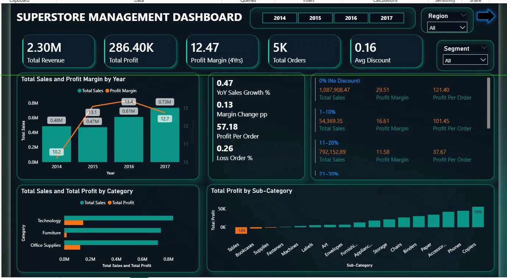
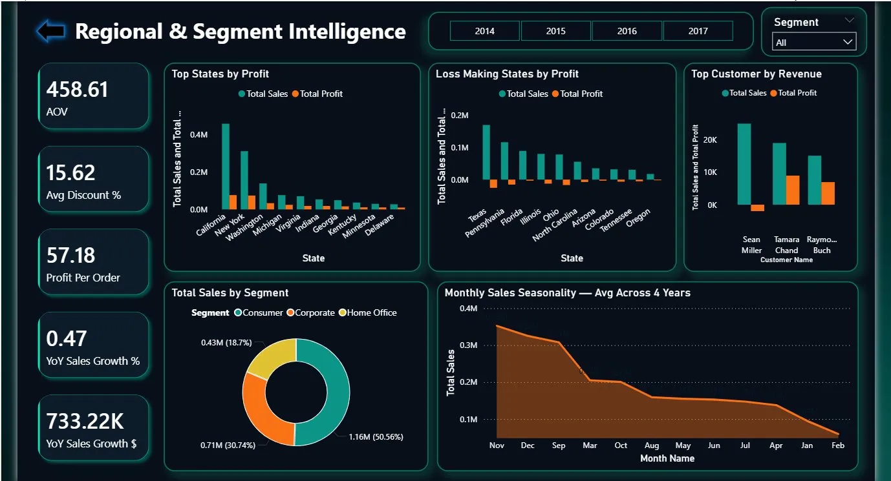

# 🛒 Superstore Sales Dashboard — Power BI Project

## 📌 Project Overview
This project analyzes Superstore sales data (2014–2017) to understand revenue trends,
profit performance, regional insights, and customer segments using Power BI.

The dashboard helps identify:
- Sales and profit performance by year
- Category and sub-category profitability
- Discount impact on profit margins
- Regional performance (top & loss-making states)
- Customer segment contribution
- Monthly sales seasonality trends

---

## 📊 Key Metrics (from Dashboard)
| Metric | Value |
|--------|-------|
| 💰 Total Revenue | $2.30 Million |
| 📈 Total Profit | $286.40K |
| 📉 Profit Margin (4 Yrs) | 12.47% |
| 📋 Total Orders | 5,000+ |
| 🏷️ Avg Discount | 0.16 (16%) |
| 🛒 Average Order Value | $458.61 |
| 📊 YoY Sales Growth % | 0.47% |
| 💵 YoY Sales Growth $ | $733.22K |
| 💸 Profit Per Order | $57.18 |
| ❌ Loss Order % | 0.26% |

---

## 📈 Key Insights

### Page 1 — Sales & Profit Overview
- **Technology** generated the highest sales and profit across all categories
- **Tables** sub-category had the biggest loss of **-$18K**
- **Copiers** was the most profitable sub-category at **$56K**
- Sales grew consistently from **$0.48M (2014)** to **$0.73M (2017)**
- Higher discounts (21–30%) significantly reduced profit margins
- Orders with **0% discount** had the highest profit margin of **29.51%**

### Page 2 — Regional & Segment Intelligence
- **Consumer segment** dominates with **50.56%** of total sales ($1.16M)
- **Corporate segment** contributes **30.74%** ($0.71M)
- **Home Office** accounts for **18.7%** ($0.43M)
- **California & New York** are the top profit-generating states
- **Texas & Pennsylvania** are the biggest loss-making states
- **November & December** are peak sales months across all 4 years

---

## 🖼️ Dashboard Preview

### Page 1 — Sales Management Overview

### Page 2 — Regional & Segment Intelligence

---

## 📂 Dataset
- **Source:** Sample Superstore Dataset
- **Period:** 2014 – 2017
- **File:** `Sample_Superstore.csv`

---

## 🔧 Tools Used
- **Microsoft Power BI** — Interactive dashboard & data visualization
- **Power Query** — Data cleaning and transformation
- **DAX** — Calculated measures and KPIs

---

## 📊 Dashboard Features
- **KPI Cards** — Total Revenue, Profit, Orders, Avg Discount, AOV
- **Year Filter Buttons** — 2014, 2015, 2016, 2017
- **Region & Segment Slicers**
- **Sales & Profit Margin by Year** — Dual axis combo chart
- **Discount Bracket Analysis** — Profit impact by discount range
- **Category & Sub-Category Charts** — Sales vs Profit comparison
- **Top States by Profit** — Bar chart
- **Loss Making States** — Bar chart
- **Top Customers by Revenue** — Bar chart
- **Segment Donut Chart** — Consumer, Corporate, Home Office
- **Monthly Sales Seasonality** — Avg across 4 years

---

## 👤 Author
**Sarthak Ranjan Nayak**
